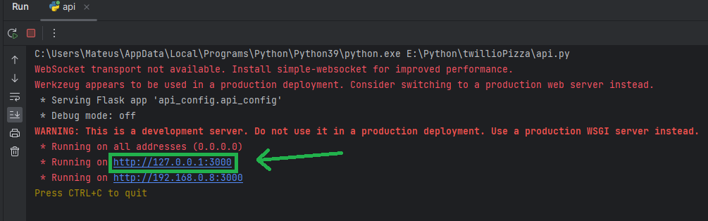

# Project Overview

This project is a chatbot that allows users to order pizza through many different platforms. Actually it supports:
- Whatsapp
- Facebook
- Instagram

It is built using Dialogflow and Firebase.

# Documentation Summary

## API Configuration Component
- [API Config](docs/api_config/api_config.md)

## API Routes Component
- [Conversation Routes](docs/api_routes/conversation_routes.md)
- [Test Routes](docs/api_routes/test_routes.md)
- [User Routes](docs/api_routes/user_routes.md)

## Data Component
- [Message Converter](docs/data/message_converter.md)
- [Speisekarte Extraction](docs/data/speisekarte_extraction.md)

## Firebase Component
- [Firebase Connection](docs/firebaseFolder/firebase_connection.md)
- [Firebase Conversation](docs/firebaseFolder/firebase_conversation.md)
- [Firebase Core Wrapper](docs/firebaseFolder/firebase_core_wrapper.md)
- [Firebase Credentials](docs/firebaseFolder/firebase_credentials.md)
- [Firebase User](docs/firebaseFolder/firebase_user.md)

## Fulfillment Component
- [Dialogflow Automated Fulfillment](docs/fulfillment/dialogflowAutomatedFulfillment.md)
- [Dialogflow Fulfillment Setter](docs/fulfillment/dialogflowFulfillmentSetter.md)
- [Instagram Automated Fulfillment](docs/fulfillment/instagramAutomatedFulfillment.md)
- [Ngrok Getter](docs/fulfillment/ngrokGetter.md)

## Intent Manipulation Component
- [Dispatcher](docs/intentManipulation/dispatcher.md)
- [Intent Manager](docs/intentManipulation/intent_manager.md)

## Order Processing Component
- [Drink Processor](docs/orderProcessing/drink_processor.md)
- [Order Builder](docs/orderProcessing/order_builder.md)
- [Pizza Processor](docs/orderProcessing/pizza_processor.md)

## Socket Emissions Component
- [Socket Emissor](docs/socketEmissions/socket_emissor.md)

## Utilities Component
- [Decorators](docs/utils/decorators/)
  - [Firebase Connection Decorator](docs/utils/decorators/firebase_connection_decorator.md)
  - [Singleton Decorator](docs/utils/decorators/singleton_decorator.md)
  - [Time Decorator](docs/utils/decorators/time_decorator.md)
- [Core Utils](docs/utils/core_utils.md)
- [Env to JSON](docs/utils/env_to_json.md)
- [Helper Utils](docs/utils/helper_utils.md)
- [Instagram Utils](docs/utils/instagram_utils.md)
- [System Utils](docs/utils/system_utils.md)

# Helper Component
- [Helper Files](docs/helper_components.md)

# Setup Guide

## Building your .env file

The .env file can be break down into 4 main parts:

- Firebase variables
- Dialogflow variables
- Instagram variables
- Twilio variables

### Firebase variables

We need to get the SDK .json file. To do so, follow the steps according to the pictures below:

Your .json file should look like this

Now we need to get the FIREBASE_DATABASE_URL variable.

With the .json file and the database URL in hands, here is what we have got so far:

- FIREBASE_DATABASE_URL=value
- FIREBASE_SDK_TYPE=value
- FIREBASE_SDK_PROJECT_ID=value
- FIREBASE_SDK_PRIVATE_KEY_ID=value
- FIREBASE_SDK_PRIVATE_KEY=value
- FIREBASE_SDK_CLIENT_EMAIL=value
- FIREBASE_SDK_CLIENT_ID=value
- FIREBASE_SDK_AUTH_URI=value
- FIREBASE_SDK_TOKEN_URI=value
- FIREBASE_SDK_AUTH_PROVIDER_X509_CERT_URL=value
- FIREBASE_SDK_CLIENT_X509_CERT_URL=value

### Dialogflow variables

In order to get the dialogflow variables, the process is quite similar. You just need to set up your dialogflow project
to use the same google account that you used to set up the firebase project. Then, you can get the same .json file and
rename the variables that start with FIREBASE_ to start with DIALOGFLOW_.

- DIALOGFLOW_TYPE=value
- DIALOGFLOW_PROJECT_ID=value
- DIALOGFLOW_PRIVATE_KEY_ID=value
- DIALOGFLOW_PRIVATE_KEY=value
- DIALOGFLOW_CLIENT_EMAIL=value
- DIALOGFLOW_CLIENT_ID=value
- DIALOGFLOW_AUTH_URI=value
- DIALOGFLOW_TOKEN_URI=value
- DIALOGFLOW_AUTH_PROVIDER_X509_CERT_URL=value
- DIALOGFLOW_CLIENT_X509_CERT_URL=value

### Twilio variables

Twilio is even more straightforward. You just need to login and see these 3 variables on the front page

- TWILIO_ACCOUNT_SID=value
- TWILIO_AUTH_TOKEN=value
- TWILIO_PHONE_NUMBER=value

### Instagram variables

You just need to log in your application front page (on the Meta for Developers website)

- INSTAGRAM_ACCESS_TOKEN=value

## Running the server and exposing the URL using ngrok

Run the api.py file, located in the root folder of the project.

If everything is running correctly, you should get a "Hello World" response when trying to access the localhost:3000 URL

Now open ngrok and type "ngrok http 3000" in the terminal.

You should get something like this:

You can visit the URL exposed by ngrok to check if everything is running correctly

## Manually setting up the webhooks with the new exposed URL

We have 3 different webhooks to set.
- dialogflow webhook
- twilio webhook
- instagram webhook

Let's start with the first one

### Setting up the dialogflow webhook

Go to the dialogflow console and click on the "Fulfillment" tab

Enable the webhook and paste the ngrok URL in the URL field

### Setting up the twilio webhook

Go to the twilio console and click on Messaging -> Try it out -> Send a Whatsapp message

Click on "Sandbox settings"

Paste the ngrok URL in the "WHEN A MESSAGE COMES IN" field

### Setting up the instagram webhook

Access the "Meta for Developers" website and choose your app in order to open the console. Once you are on the console
page, go to Messenger -> Instagram settings

Click on "Edit Callback URL" button

Paste the ngrok URL in the "Callback URL" field

Automatically setting up the webhooks

## Automatically setting up the webhooks
Manually setting up webhooks can be very painful, especially if you are testing the application in different machines.
To avoid this, we have created a script that automatically sets up the webhooks for you.

Unfortunately right now it only works for dialogflow and instagram. We are still working on the twilio part.

- Start the ngrok service

- Go to _fulfillmentSetter.py

This function performs the whole pipeline of setting up the webhooks.

- It automatically gets the current ngrok URL
- It sets up the dialogflow webhook
- It sets up the instagram webhook

### Note
The instagram automated webhook setter works using a webscrapper with the selenium package. In order to make it work,
you need to pass your username and password to the .env file

- INSTAGRAM_EMAIL=value
- INSTAGRAM_PASSWORD=value

If you want to check how these values are used, go to `webscrapping/instagramWebhookChanger.py`

