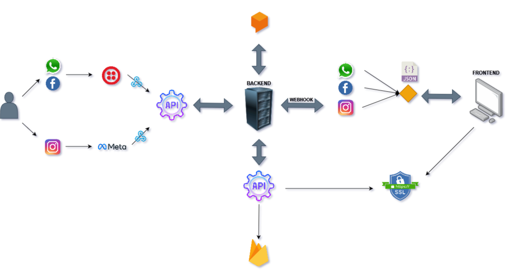

# Project Overview

This project is a chatbot that allows users to order pizza through Instagram. It is built using Dialogflow and Firebase.

# Helper Components
## _fulfillmentSetter.py
This module is responsible for setting up the fulfillment URL for the chatbot. It takes the current exposed URL by ngrok 
and sets it up in to the corresponding component. It is a wrapup of several individual fulfillment's
- Dialogflow
- Instagram
- Twilio

## Functions

### [Get All Conversations](api_docs/get_all_conversations.md)

This is a basic endpoint that returns all the conversations stored in the database.

- URL: `https://us-central1-pizzadobill-rpin.cloudfunctions.net/get_all_conversations`
- Method: `GET`

### [Update Conversations](api_docs/update_conversations.md)

This endpoint updates a given conversation stored in the database.

- Path: `/get_all_queries`
- Method: `POST`

For more detailed information about each endpoint, click on the endpoint name to access its full documentation.
